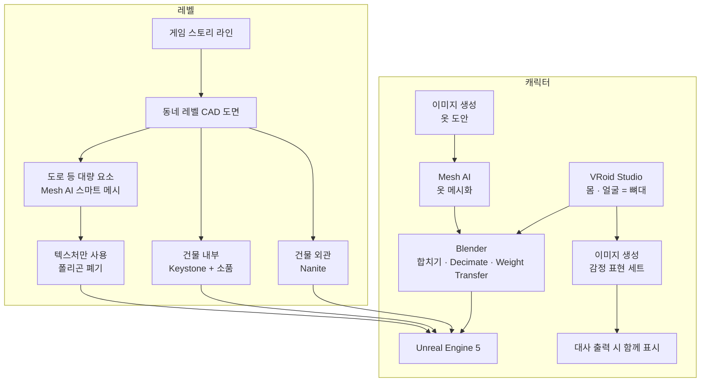
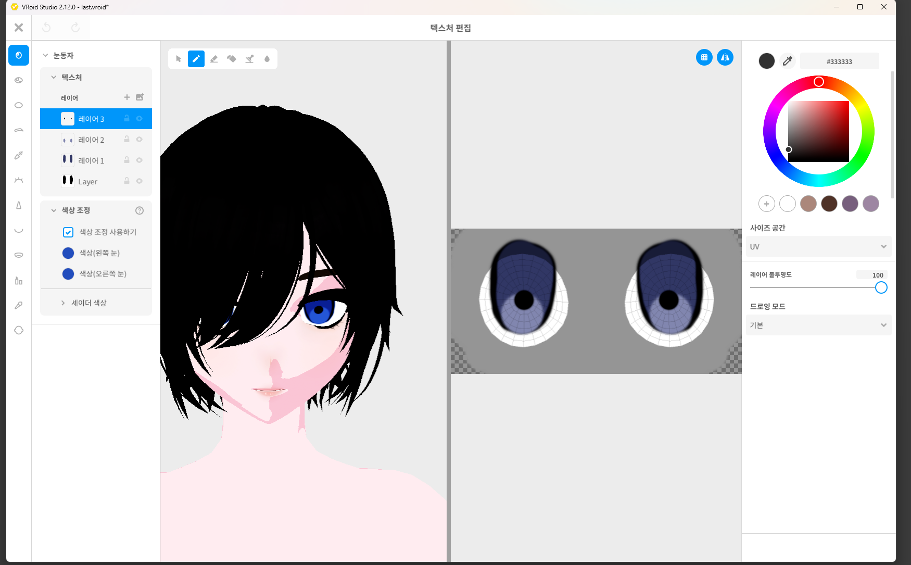
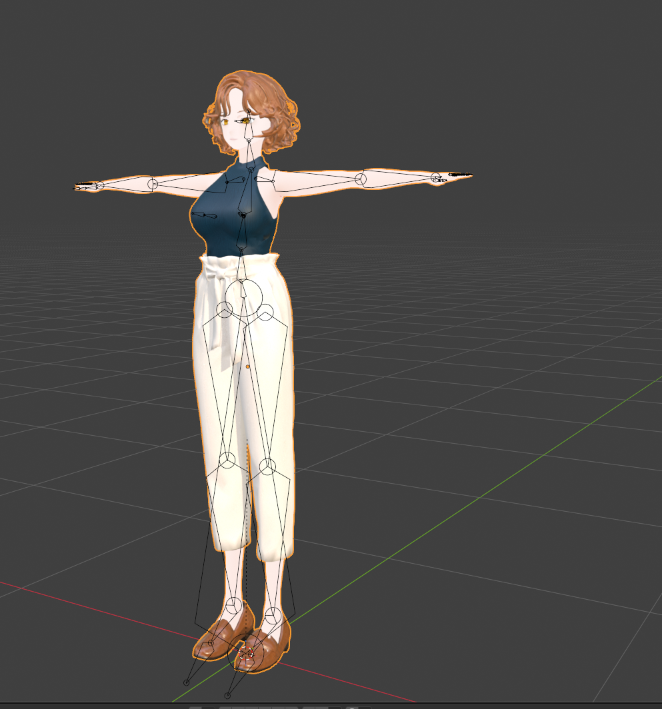
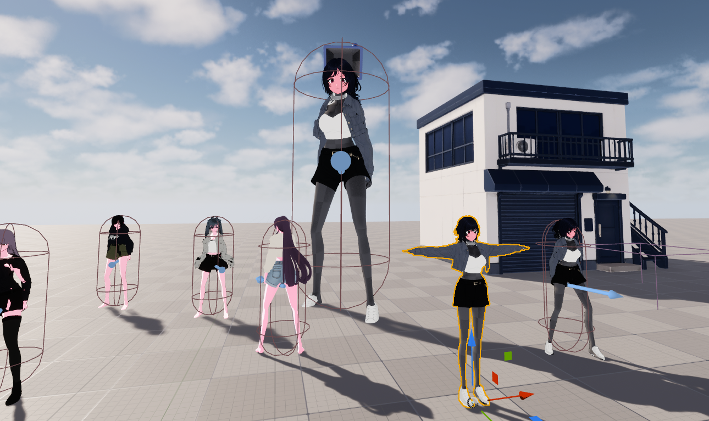
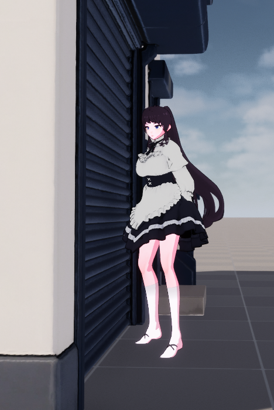
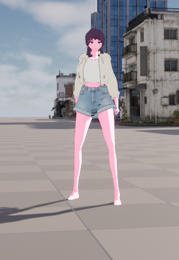
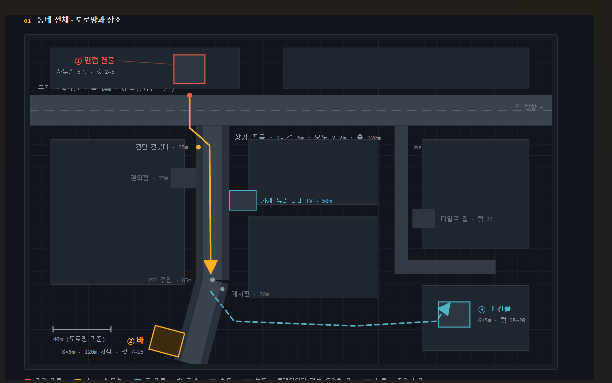
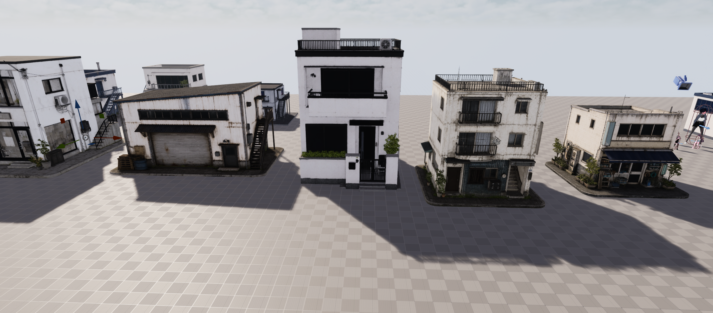
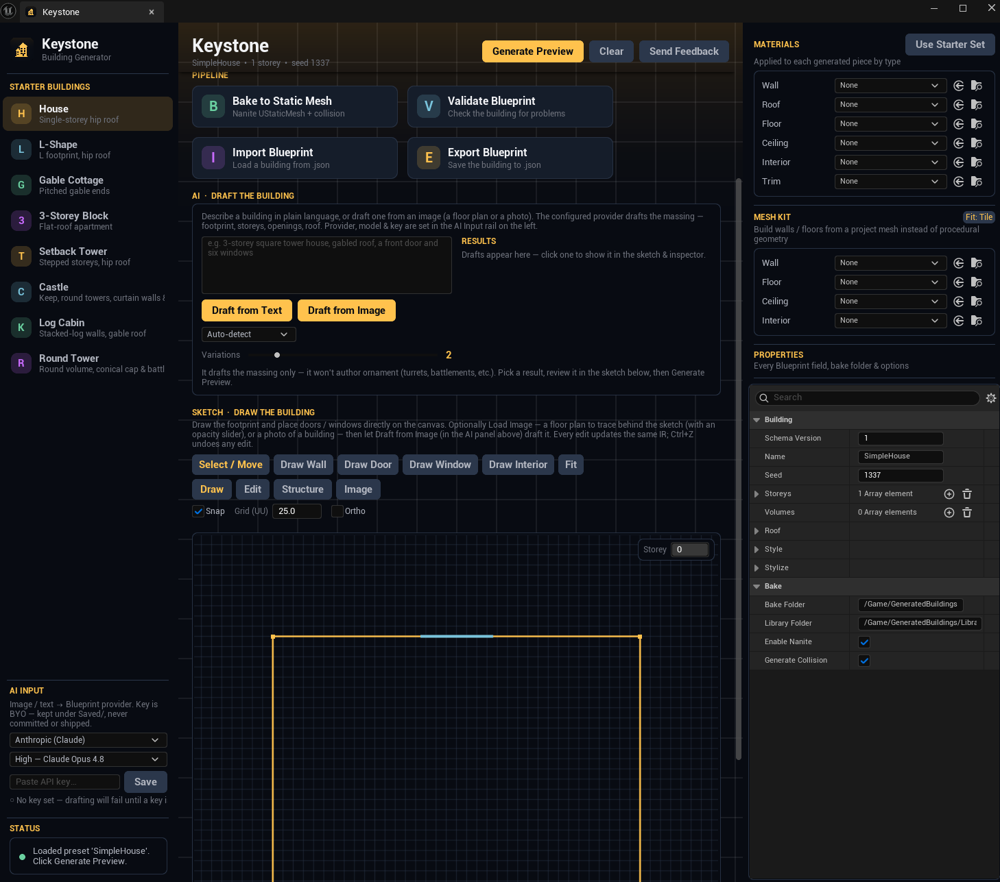
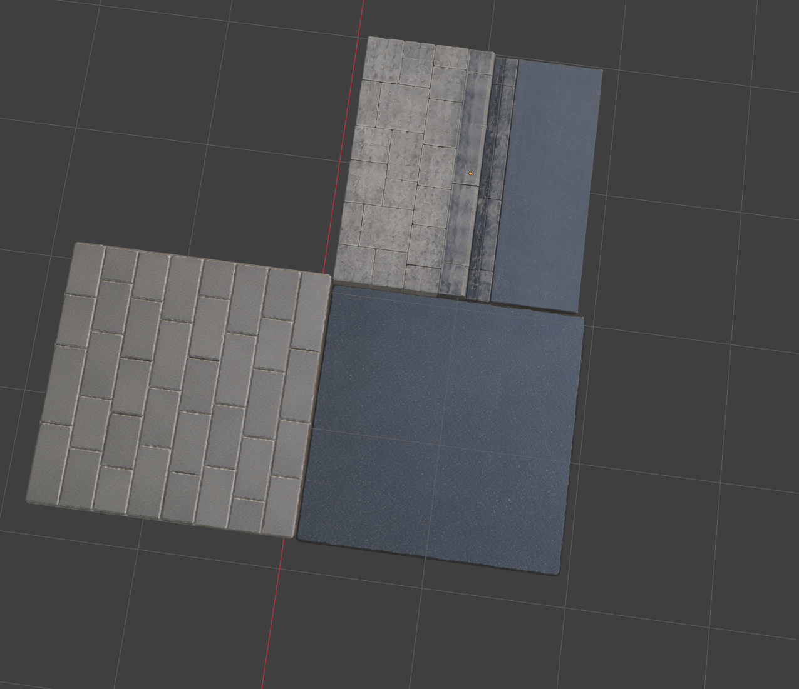

https://github.com/PPIONN/22Devils-Text_Console_RPG (첫번째 팀플 지원서에 링크 잘못올라감. 제대로된 링크)
# Secret Project — 작업 파이프라인

스토리 진행형 게임을 만들면서 쓰는 **캐릭터 · 레벨 제작 파이프라인**을 정리한 문서다.
스토리 진행형 게임이라 캐릭터와 레벨 같은 시각 요소가 곧 게임의 값이고, 그 양을 혼자 감당하기 위한 방식이다.

---

## 1. 캐릭터

### 1-1. VRoid Studio — 뼈대

캐릭터는 VRoid에서 만든 모델을 **뼈대로** 쓴다. 이후 모든 작업이 이 모델을 기준으로 간다.

### 1-2. 옷 — 이미지 생성 → Mesh AI

1. 이미지 생성으로 **옷 이미지를 뽑는다**
2. 그 이미지를 **Mesh AI**에 넣어 메시로 만든다

### 1-3. Blender — 합치기 · Decimate · Weight Transfer

Mesh AI로 뽑은 옷을 VRoid 모델과 합친다.

| 작업 | 내용 |
|---|---|
| **Decimate** | 폴리곤을 게임에 쓸 수 있는 밀도로 줄인다 |
| **Weight Transfer** | 본체의 웨이트를 옷으로 옮겨 뼈를 따라 같이 움직이게 한다 |

### 1-4. Unreal Engine — 반입

여기까지 하면 캐릭터 디자인은 끝난다.

<table>
<tr>
<td width="50%"></td>
<td width="50%"></td>
</tr>
</table>

### 1-5. 감정 표현

VRoid 모델의 감정 표현이 아쉬워서, **모델 대신 이미지로 대체**한다.

1. VRoid 캐릭터를 이미지 생성에 넘긴다
2. 그 캐릭터의 **다양한 감정 표현 이미지**를 뽑는다
3. 대화 출력 중 함께 나오게 한다

---

## 2. 레벨

### 2-1. 스토리 라인 → 동네 레벨 CAD

게임 스토리 라인에 따라 **동네 레벨의 CAD 도면**을 먼저 뽑는다.

### 2-2. 건물 외관 — Nanite

건물 외관은 **언리얼의 Nanite**를 통한 비용 최적화로 부담을 줄인다.

### 2-3. 건물 내부 — 소품 + Keystone

내부는 **소품을 따로 뽑고**, 내부 구조는 **Keystone 툴로 짠다.**

### 2-4. 도로 등 대량 요소 — Mesh AI 스마트 메시

도로처럼 **비용이 비싸면 안 되는 요소**는 Mesh AI의 스마트 메시로 비용을 줄여 뽑는다.

- 뽑으면 **텍스처를 포함한 메시**가 나오고, 텍스처에는 **알베도 · 노멀 · 메탈릭** 등 필요한 요소가 합쳐서 나온다
- **폴리곤은 더러우니 버리고, 텍스처 관련 요소만 가져다 쓴다**

---

## 요약

| 대상 | 방식 |
|---|---|
| 캐릭터 뼈대 | VRoid Studio |
| 의상 | 이미지 생성 → Mesh AI → Blender 결합 |
| 의상 최적화 | Decimate + Weight Transfer |
| 감정 표현 | 이미지 세트로 대체, 대화 출력 시 표시 |
| 레벨 설계 | 스토리 라인 → 동네 CAD 도면 |
| 건물 외관 | Nanite |
| 건물 내부 | 소품 개별 제작 + Keystone 구조 |
| 도로 등 대량 요소 | Mesh AI 스마트 메시 → 텍스처만 사용 |
