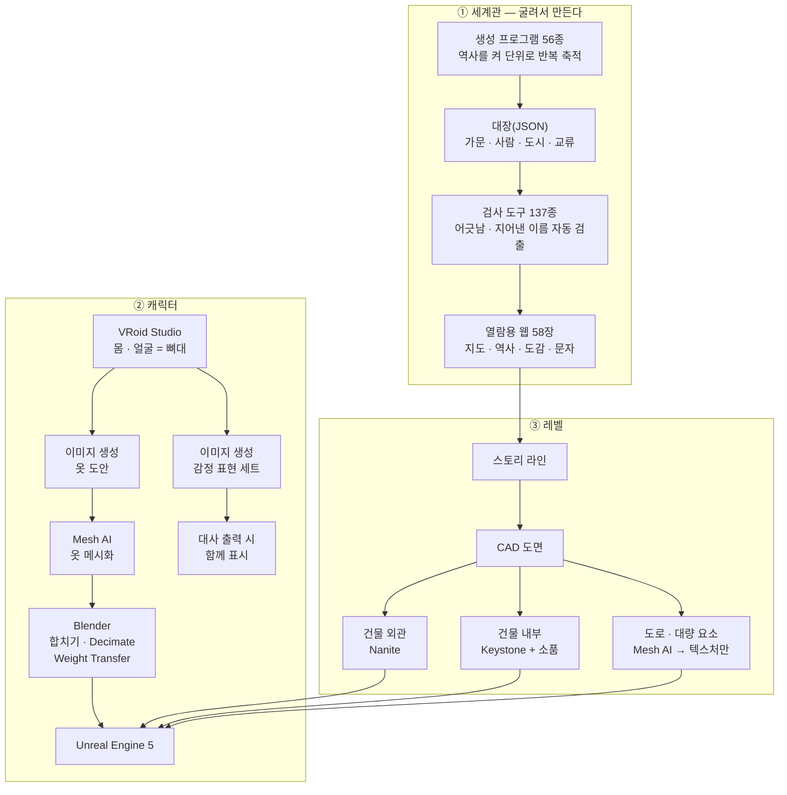

https://github.com/PPIONN/22Devils-Text_Console_RPG (첫번째 팀플 지원서에 링크 잘못올라감. 제대로된 링크)
# Secret Project

> **스토리 진행형 게임 · 1인 개발 기록**
> 세계관 → 캐릭터 → 레벨까지, 혼자서 감당할 수 있는 파이프라인을 짜는 것이 이 프로젝트의 절반이다.
> 이 문서는 그 파이프라인과 지금까지 만든 것을 정리한 작업 일지다.

---

## 전체 파이프라인

---

# ① 세계관 — 손으로 쓰지 않고 굴린다

이야기를 얹을 땅이 먼저 필요했다. 문제는 **혼자 쓰기엔 양이 감당이 안 된다**는 것이었다.
그래서 설정을 문서로 적어 나가는 대신, **역사를 굴리는 프로그램을 만들고 그 산출물을 정본으로 삼는 방식**으로 갔다.

### 만들어진 것

| | |
|---|---|
| **세계 역사** | W.0 ~ W.16,980 · **스물다섯 개의 시대** |
| **가문** | 5,597 (줄기 655) |
| **인물** | 24,364 |
| **도시** | 348 |
| **세력 간 교류 기록** | 1,048 |
| **기획 문서** | 420편 |
| **열람용 웹 페이지** | 58장 |

### 세계 지도

대륙 하나, 그 바깥은 아직 열어 둔 채로 둔다. 표식을 누르면 그 땅의 역사로 들어간다.

### 역사 — 명확하게, 끝까지 이어지도록

만 육천 년을 시대별로 끊어 정리했다. 제국이 세 번 섰고 두 번은 무너졌고 한 번은 스스로 풀렸다 —
같은 굵은 사건이 **왜 그 자리에서 일어날 수밖에 없었는지**가 이어져야 이야기를 얹을 수 있다.

### 도감 · 문자

세계 안의 물건과 기술을 도감으로 정리했고(129항목), 세계 안에서 쓰는 **문자 체계**도 따로 설계했다.
닿소리 22자 · 홀소리 열 — 소리의 갈래에 따라 글자꼴이 정해진다.

<table>
<tr>
<td width="50%"></td>
<td width="50%"></td>
</tr>
<tr>
<td align="center">도감 — 물건 · 기술 129항목</td>
<td align="center">세계 안에서 쓰는 문자 체계</td>
</tr>
</table>

### 작업 방식 — 세계관을 다루는 세 가지 규칙

이 프로젝트에서 세계관을 만들 때 지키는 규칙이 있다. 이게 없으면 설정이 금세 좁아진다.

**1. 자리는 도출한다 · 사건은 「일어난다」까지만 · 행동은 도출하지 않는다**

| 층 | 어디까지 정하나 | 왜 |
|---|---|---|
| **자리** (장소 · 구조 · 역할) | **정한다.** 많이 적을수록 좋다 | 사람이 모이면 반드시 생기는 것들이다. 필연이라 지어낼 필요가 없다 |
| **사건** | **일어난다는 것까지만.** 누가·왜는 안 정한다 | 조건이 쌓이면 사건은 저절로 보인다 |
| **행동** | **정하지 않는다** | 사람의 행동은 무궁무진하다. 미리 정하면 그 하나에 갇힌다 |

**2. 역사는 명확하게, 세계의 근본은 열어 둔다**

역사(왕조·계보·사건·연대)는 빈틈없이 짠다. 반면 **마력이 정확히 무엇인가 같은 근본은 경계만 긋고 안을 비워 둔다.**
전부 확정해 버리면 나중에 새로운 것을 넣을 자리가 없어지기 때문이다.

**3. 손으로 쓰지 말고 굴려서, 그 결과를 기계로 검사한다**

- 역사·가문·인물·도시는 **생성 프로그램 56종**이 켜(layer) 단위로 반복해 쌓는다
- 앞 켜의 결과가 다음 켜의 바닥이 되게 해서 **세계가 시간에 따라 실제로 커지도록** 만들었다
- **검사 도구 137종**이 매 바퀴 산출물을 검사한다 — 정본에 인용된 이름이 실제 굴림에 없으면(= 지어낸 이름) 잡아내고, 굴림을 고쳤을 때 과거 기록이 흔들리지 않는지 대조한다
- 굴림 결과는 **웹 페이지로 바로 읽을 수 있게** 뽑는다. 읽을 수 없는 설정은 없는 것과 같다

---

# ② 캐릭터 파이프라인

### 1. VRoid Studio — 뼈대를 만든다

캐릭터의 몸과 얼굴은 VRoid에서 만든다. 여기서 나온 모델이 **이후 모든 작업의 기준 뼈대**가 된다.
눈동자·피부 같은 텍스처는 VRoid 안에서 레이어로 직접 손본다.

### 2. 옷 — 이미지 생성 → Mesh AI

옷은 VRoid의 프리셋을 쓰지 않는다.
이미지 생성으로 **원하는 옷의 도안을 뽑고**, 그 이미지를 **Mesh AI**에 넣어 메시로 만든다.
프리셋에 없는 실루엣을 쓸 수 있고, 캐릭터마다 옷이 겹치지 않는다.

### 3. Blender — 합치고, 깎고, 웨이트를 옮긴다

Mesh AI가 뱉은 옷을 VRoid 모델 위에 올려 하나로 합친다. 여기서 두 가지를 한다.

| 작업 | 왜 |
|---|---|
| **Decimate** | 생성 메시는 폴리곤이 필요 이상으로 많다. 게임에 넣을 수 있는 밀도로 깎는다 |
| **Weight Transfer** | 옷에는 스키닝 정보가 없다. VRoid 본체의 웨이트를 옷으로 옮겨야 뼈를 따라 같이 움직인다 |

### 4. Unreal Engine — 캐릭터 완성

웨이트까지 옮긴 모델을 언리얼로 가져오면 캐릭터 디자인은 끝난다.

<table>
<tr>
<td width="50%"></td>
<td width="50%"></td>
</tr>
<tr>
<td align="center">같은 뼈대 · 다른 옷</td>
<td align="center">레벨 안에 세워 본 모습</td>
</tr>
</table>

---

# ③ 감정 표현 — VRoid가 못 하는 것을 이미지로 메운다

스토리 진행형 게임이라 **대사 중 표정이 곧 연출**인데, VRoid 모델의 표정 표현은 여기에 못 미친다.
그래서 **모델 자체를 손대는 대신 그림으로 대체**한다.

1. 완성된 VRoid 캐릭터를 이미지 생성에 넘긴다
2. 그 캐릭터의 **감정 표현 이미지 세트**를 뽑는다
3. 대사가 출력될 때 그 이미지를 함께 띄운다

모델의 표정 리깅을 파고드는 대신, 인물마다 표정 장을 갖는 쪽을 택했다.

---

# ④ 레벨 파이프라인

### 1. 세계관 → 도시 골격 → 동네 도면

레벨을 바로 세우지 않는다. **세계관에서 정해진 도시를 먼저 도면으로 내린다.**
좌표는 정본 파일 하나에서만 나오게 하고(단위 m), 구역·다리·역·높이를 도면에 박아 둔다.

그다음 스토리에 실제로 쓰이는 동네를 확대해, **도로 폭·건물까지의 거리·어느 컷에서 쓰이는 장소인지**까지 적는다.
이게 있어야 나중에 지은 것들이 서로 안 어긋난다.

### 2. 건물 외관 — Nanite로 비용을 넘긴다

건물 외관은 디테일이 곧 분위기라 폴리곤을 줄이기 아깝다.
그래서 줄이지 않고 **언리얼의 Nanite에 최적화를 맡긴다.**

### 3. 건물 내부 — Keystone으로 구조를, 소품은 따로

내부는 외관과 다른 방식으로 간다.
**소품은 따로 뽑고, 내부 구조는 Keystone(빌딩 제너레이터)으로 짠다.**
벽·문·창을 도면 위에 그려 구조를 만들고 Nanite 스태틱 메시로 굽는다.

### 4. 도로 등 대량 요소 — 텍스처만 취하고 폴리곤은 버린다

도로·보도처럼 **넓게 깔리는 것은 비싸면 안 된다.**
Mesh AI의 스마트 메시로 뽑으면 메시와 함께 **알베도 · 노멀 · 메탈릭이 한 벌로 나온다.**
여기서 **폴리곤은 지저분하니 버리고, 텍스처 계열만 가져다 쓴다.**
결과적으로 값싼 평면에 좋은 재질만 얹는 방식이 된다.

---

# 최적화 — 어디에 비용을 쓰고 어디서 아끼나

| 대상 | 방식 | 이유 |
|---|---|---|
| 건물 외관 | **Nanite** | 디테일을 유지한 채 비용은 엔진에 맡긴다 |
| 건물 내부 구조 | **Keystone 생성 + Nanite 베이크** | 방마다 손으로 짓지 않는다 |
| 도로 · 보도 · 대량 요소 | **Mesh AI 텍스처만 사용, 폴리곤 폐기** | 넓게 깔리는 것에 폴리곤을 쓰지 않는다 |
| 캐릭터 · 의상 | **Decimate + Weight Transfer** | 생성 메시를 그대로 쓰면 한 명도 못 세운다 |
| 캐릭터 표정 | **이미지 세트로 대체** | 리깅에 드는 시간을 연출로 돌린다 |
| 세계관 설정 | **프로그램으로 굴리고 기계로 검사** | 사람이 쓸 수 있는 양에는 한계가 있다 |

---

## 이 파이프라인의 요점

- **생성 도구의 결과물을 그대로 쓰지 않는다.** 옷은 웨이트를 옮겨야 하고, 도로는 텍스처만 남긴다. 쓸 부분만 골라 쓰는 것이 핵심이다.
- **뼈대는 하나로 고정한다.** 모든 캐릭터가 VRoid 모델을 기준으로 하므로 옷·표정·애니메이션을 돌려 쓸 수 있다.
- **레벨은 도면에서 시작한다.** 세계관이 정한 도시를 도면으로 내리고, 스토리가 요구하는 장소부터 짓는다.
- **판단은 사람이, 반복은 기계가.** 세계를 굴리는 것도 그 결과를 검사하는 것도 프로그램이 한다.

---

## 진행 상황

- [x] 세계관 역사 생성 · 검사 파이프라인 구축
- [x] 세계 지도 · 역사 · 도감 · 문자 열람 페이지
- [x] 도시 골격 CAD · 동네 레벨 도면
- [x] 캐릭터 파이프라인 (VRoid → 옷 생성 → Blender → Unreal) 확립
- [x] 건물 외관 Nanite 적용
- [x] 도로 · 보도 텍스처 확보
- [ ] 건물 내부 구조 Keystone 적용
- [ ] 감정 표현 이미지 세트 제작
- [ ] 대사 출력 시스템과 표정 연동
